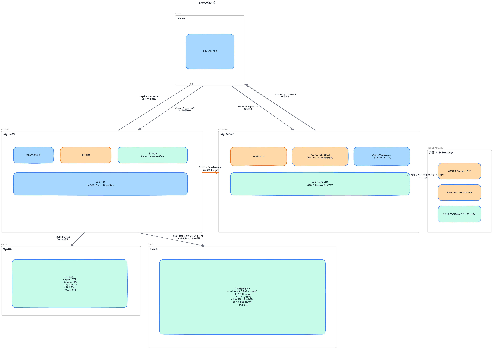
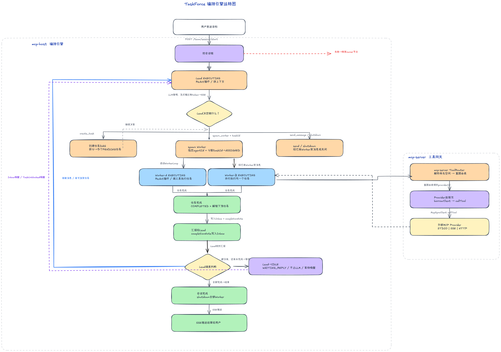

<div align="center">
  <h1>TaskForce</h1>
  <p><strong>面向云端与私有化部署的多 Agent 协作编排平台（Java / Spring）</strong></p>
  <p>
    
    
    
    
    
    
    
  </p>
  <p>
    <a href="./README.md">中文</a> |
    <a href="./README_EN.md">English</a> |
    <a href="./QUICKSTART.md">快速开始</a> |
    <a href="./mcp-server/README.md">MCP Server 文档</a>
  </p>
</div>

## 简介

TaskForce 是一个面向云端与私有化部署的多智能体协作系统。  
核心模型是 `Team Lead + Worker`：Lead 负责任务拆解与调度，Worker 负责执行与回报，系统通过事件驱动持续推进，直到会话完成。系统内建分布式会话归属、事件流恢复与对象存储同步能力，适合真实工程场景。

## 核心亮点

- **Team 模式（持久化协作）**：Lead/Worker 都是可持续运行的 ReAct 循环，不是“一次请求一次响应”的短链路调用。
- **TaskBoard DAG 编排**：任务依赖显式建模（`blockedBy` / `blocks`），支持环检测与下游自动解锁。
- **MCP 工具层工程化**：`mcp-server` 支持 `STDIO`、`REMOTE_SSE`、`STREAMABLE_HTTP`，并支持 Provider 热更新与统一路由。
- **事件流可恢复**：基于 Redis Stream + Pub/Sub，SSE 支持 `Last-Event-ID` 续传。
- **Skill 管理**：支持 Skill 导入、启用/禁用与自动加载，便于按场景扩展 Agent 能力。
- **Sandbox 执行**：支持会话隔离的 Shell/Python/文件工具执行，产物可同步到 MinIO。

## 架构示意





## 快速开始

### 依赖

- Java 21
- Maven 3.9+
- Node.js 20+
- MySQL 8.0
- Redis 7

### 配置说明（很重要）

- 默认配置已在 `application.yml` 提供，可直接用于本地启动。
- 如果你的 MySQL / Redis 有账号密码、地址端口或其他敏感配置，请在 `TaskForceBackEnd/src/main/resources/application-local.yml` 和 `mcp-server/src/main/resources/application-local.yml` 覆盖。
- 前端开发默认通过 Vite 代理 `/api -> http://localhost:8080`，如需修改请调整 `TaskForceFrontEnd/vite.config.ts`。

### 启动顺序

```bash
# 1) MCP Server (:8082)
cd mcp-server
mvn spring-boot:run

# 2) Backend (:8080)
cd ../TaskForceBackEnd
mvn spring-boot:run

# 3) Frontend (:5173)
cd ../TaskForceFrontEnd
npm install
npm run dev
```

打开 [http://localhost:5173](http://localhost:5173) 后，配置 LLM Provider 即可开始使用。

更多配置、数据库初始化和 FAQ 请看：[`QUICKSTART.md`](./QUICKSTART.md)

## 项目结构

```text
TaskForce/
├── TaskForceBackEnd/          # 后端主服务（编排引擎 + 业务 API）
├── TaskForceFrontEnd/         # 前端（Web + Electron）
├── mcp-server/                # MCP 工具服务
├── public/images/             # 架构图
├── QUICKSTART.md              # 中文快速开始
└── README_EN.md               # 英文说明
```

## 技术栈

- 后端：Spring Boot 3.3.4、Spring AI、Spring AI Alibaba、MyBatis-Plus、Redis、MySQL
- 前端：React 19、TypeScript 5、Vite 7、TailwindCSS 4、Zustand
- MCP：Spring Boot + Spring AI MCP Client

## License

Apache License 2.0，见 [`LICENSE`](./LICENSE)。
